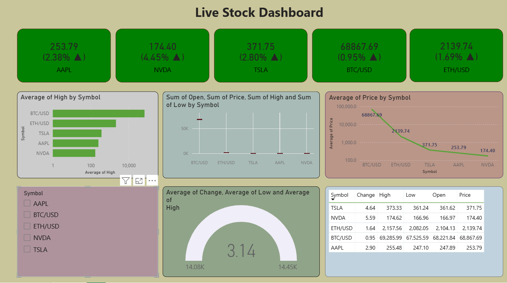

# Live Stock Market Dashboard

An interactive stock market analytics dashboard built using Power BI.
This project analyzes dynamic stock market data fetched from the Twelve Data API.

## Data Source
Stock market data is dynamically fetched from Twelve Data API and used for real-time analysis.

## Features
* KPI cards showing latest stock prices
* Average price trend visualization
* Symbol-wise filtering using slicers
* Gauge chart for market change
* Detailed stock metrics table
* Interactive and dynamic dashboard

## Tools & Technologies
* Power BI
* Twelve Data API
* Data Visualization

## preview

## Author
Charishma Saragadam
